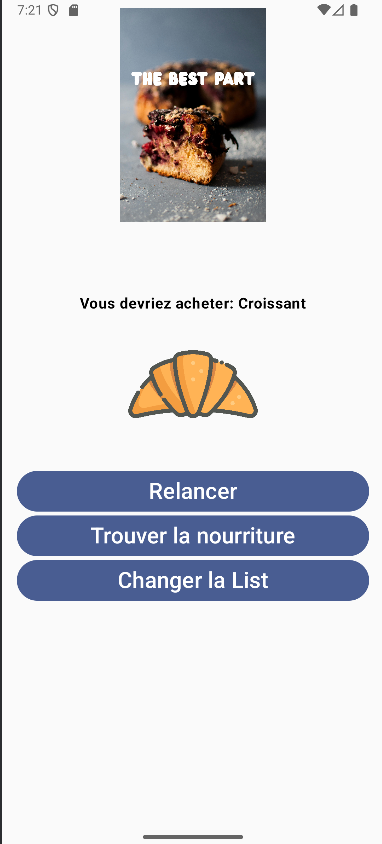
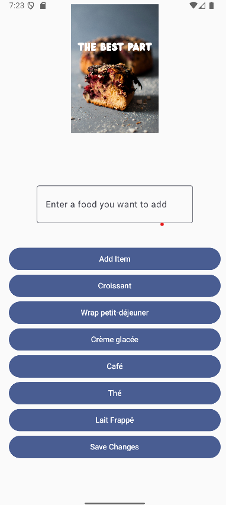

# Mobile-Dev-Assign-2

## Descriptive Title
    FoodRecommendationApp

## Overview/Description
    Explore The Food Recommendation app to get recommendation on foods to try with nearby locations on where to get them and have fun 
    making a list of foods! This app allows you to randomly get recommended a food by clicking the reroll button. You can also
    open maps app with nearby places to get the recommended food by clicking on the image or get a google search
    of the food to find a place near you by clicking on the find food button. You can change the list of foods by clicking
    on the change list button. You can add a food to the list or you can even remove certain foods by clicking on that specific 
    food button. Once you are satisfied with your changes you can go back to the home page by saving your changes.  

## Setup Instructions
    To run the app you can either open the project in android studio and run the code or run it on a compatible android device.

## Known Bugs
    If multiple foods are added with the same name if one of them are removed all of them are removed this could lead to to there being no food buttons

## Image-Sources: 
    Random food: https://unsplash.com/illustrations/a-black-and-white-image-of-a-plate-fork-and-knife-7RyxCHAoRIc

    Croissant: https://unsplash.com/illustrations/a-delicious-golden-croissant-is-the-image-zlTQxhtssIo

    Coffee: https://unsplash.com/illustrations/a-cup-of-coffee-with-coffee-beans-UMbU32lqpBA

    Ice cream: https://unsplash.com/illustrations/a-delicious-ice-cream-sundae-is-ready-to-eat-VWYSLp26xIg

    Breakfast wrap: https://unsplash.com/illustrations/a-tasty-looking-shawarma-is-pictured-here-aPFzgyqpcxM

    Milkshake: https://unsplash.com/illustrations/heres-a-possible-caption-a-delicious-milkshake-with-a-wafer-stick-SGEn6JaPHJM

    Tea: https://unsplash.com/illustrations/steaming-cup-of-tea-with-tea-bag-and-leaves-0yH6K6KTK2Y

    

